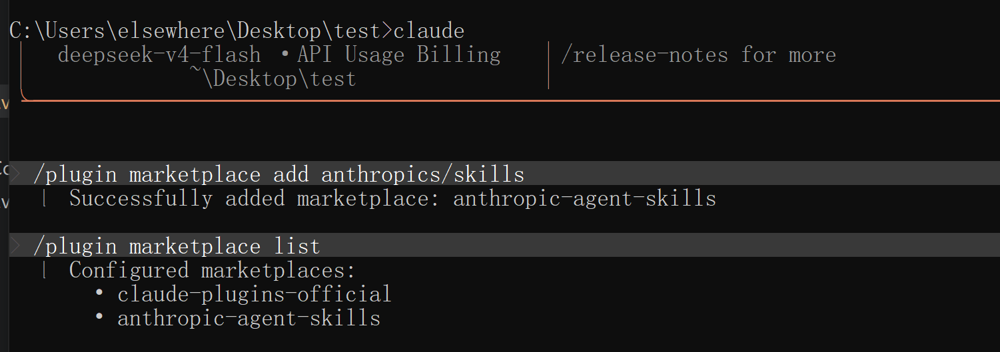
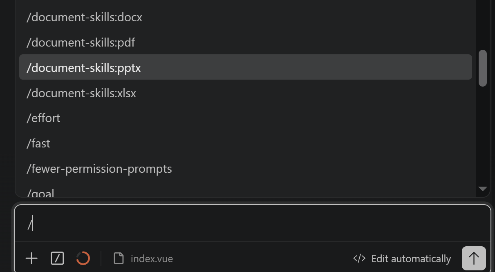

# Claude Code 常用

- [ClaudeCode学习笔记](https://www.yuque.com/zhiyan-cka3b/tv4xix/hisi8t8k72yaia2u?singleDoc#C8Zvm)

- [安装视频](https://www.bilibili.com/video/BV1oPFDzQEG7/)

- [Claude Code 不再推荐 npm 安装](https://blog.csdn.net/ko800008ok/article/details/159004066)

- [Claude Code 安装 - 中文站](https://claude-zh.cn/guide/getting-started)

  

  ## 常用命令

  | 序号 | 命令                                  | 解释                                   |
  | ---- | ------------------------------------- | -------------------------------------- |
  | 1    | claude --dangerously-skip-permissions | 自动执行命令行内容                     |
  | 2    | ctrl+g                                | 在文笔中写入内容                       |
  | 3    | \                                     | 命令行换行                             |
  | 4    | !                                     | 执行脚本命令：ls pwd                   |
  | 5    | Esc Esc                               | 任务执行错了，回滚。或/rewind          |
  | 6    | ctrl+b                                | 后台执行任务                           |
  | 7    | /tasks                                | 查看后台执行的任务                     |
  | 8    | /init                                 | 生成CLAUDE.md文件                      |
  | 9    | claude -c                             | 直接进入上次对话                       |
  | 10   | claude -r                             | 选择历史会话恢复，适合中途推出后续工作 |
  | 11   | **shfit+tab**                         | **选择模式:计划模式，编辑模式**        |
  |      |                                       |                                        |
  |      |                                       |                                        |

  

  

  # win powershell安装

  ```powershell
  & ([scriptblock]::Create((New-Object Net.WebClient).DownloadString("https://claude-zh.cn/scripts/install.ps1")))
  ```

  ## 修改 C:\Users\username\.claude.json文件，增加如下内容

  ```
  "hasCompletedOnboarding": true,
  ```

- cc-switch 下载

  > [Release CC Switch v3.14.1 · farion1231/cc-switch](https://github.com/farion1231/cc-switch/releases/tag/v3.14.1)


## 安装claude code skill

https://github.com/anthropics/skills

- 添加官方 Skill 仓库

  > /plugin marketplace add anthropics/skills
  > /plugin list



- 安装技能

```
# PDF/Excel/Word/PPT全套文档技能（开发最常用）
/plugin install document-skills@anthropic-agent-skills

# 官方示例技能包
/plugin install example-skills@anthropic-agent-skills

# 代码评审专用技能
/plugin install code-review@anthropic-agent-skills

#重载生效
/skills reload
```

验证skill 生效




## 案例

```
案例1:我想开发一个电商网站，基于html5开发，不需要数据库，请帮我单独创建一个项目文件夹：shop-html，首先生成项目需求和技术方案到plan.md文件中，然后将一些html项目代码生成规范系统提示词输出到CLAUDE.md文件中， 之后执行plan.md中计划去写代码的时候，需要参考CLAUDE.md文件中提到的规范
```


