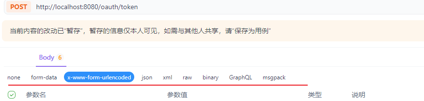

## 常用工具

​    Apifox、Postman

 

## 常见的content-type

| 类型                                | 含义                 | 特点                                                |
| ----------------------------------- | -------------------- | --------------------------------------------------- |
| none                                | 无 Body              | 常用于 GET 请求，不携带数据                         |
| `multipart/form-data`               | 多部分表单数据       | 用于上传文件和其他表单数据，支持二进制内容          |
| `application/x-www-form-urlencoded` | 表单数据（URL 编码） | 常用于 HTML 表单提交，键值对以 `key=value` 形式传输 |
| `application/json`                  | JSON 数据            | 一种轻量级的数据交换格式，广泛用于 API 通信         |
| `application/xml`                   | XML 数据             | 一种标记语言，常用于数据交换和配置文件              |
| Raw                                 | 原始文本             | 可以是任意格式的文本（如 JSON、XML、HTML 等）       |
| Binary                              | 二进制数据           | 如图片、视频、文件等二进制内容                      |
| GraphQL                             | GraphQL 查询         | 一种 API 查询语言，常用于前后端通信                 |
| msgPack                             | MessagePack 数据     | 一种高效的二进制序列化格式                          |

