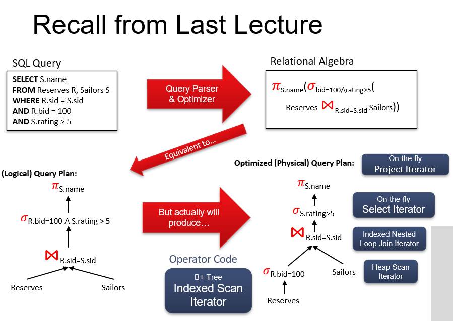

-  ==**当前进度：11 Joins final JMH.pptx**==

  > 看完第30

# 08 Buffer Management Final

- Pin Count（钉住计数）是数据库缓冲池管理中，与每个**缓存数据页**相关联的一个**整型计数器**。

  > 它用于跟踪当前**有多少个活跃**的数据库线程或操作**正在访问（读取或修改）该特定数据页**。

- pin Count 是一个计数器，用于跟踪当前有多少个**用户**”或**操作**正在使用 Buffer Pool 中的某个特定数据页。它的核心目的是防止一个正在被使用的数据页被换出（驱逐）缓冲区。

# 09 Sort Hash -JMH FINAL

# 10 relational algebra - final - jmh

- **Joins** ( ⋈𝜃 , ⋈ ): Combine relations that satisfy predicates

- **Projection** (**p** ): Retains only desired columns (vertical)

- **Selection** (**s** ): Selects a subset of rows (horizontal)

- **Renaming** ( **𝜌** ): Rename attributes and relations.

  

# 11 Joins final JMH

30
