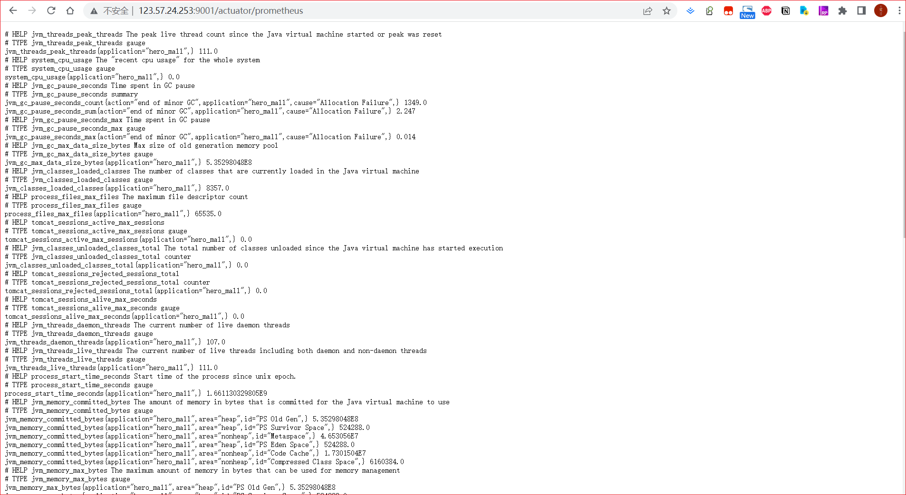
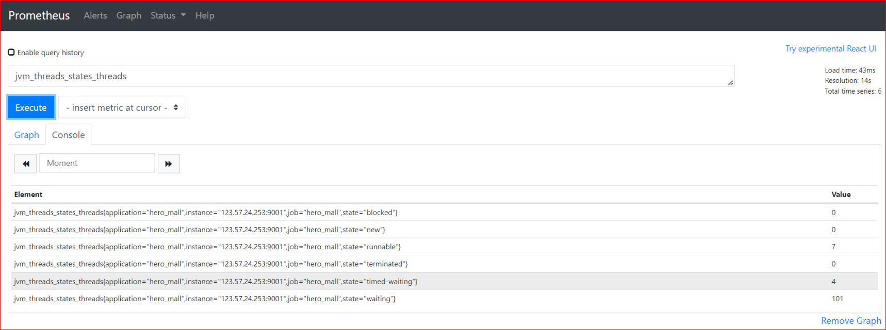
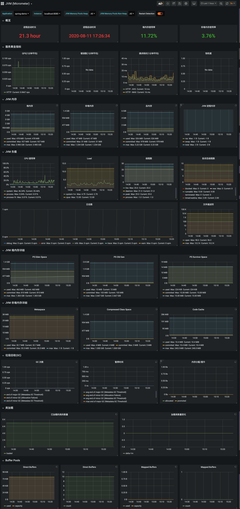

### 本资源由 itjc8.com 收集整理
# SpringBoot应用JVM监控环境搭建Grafana+Prometheus+Micrometer


## 01-SpringBoot自带监控Actuator

SpringBoot自带监控功能Actuator，可以帮助实现对程序内部运行情况监控，比如监控内存状况、CPU、Bean加载情况、配置属性、日志信息、线程情况等。

使用步骤：

1. 导入依赖坐标

   ```xml
   <dependency>
       <groupId>org.springframework.boot</groupId>
       <artifactId>spring-boot-starter-actuator</artifactId>
   </dependency>
   ```

2. 访问监控地址： http://127.0.0.1:9001/actuator 

**监控应用endpoint：**

| 路径            | 描述                                                         | 默认开启 |
| --------------- | ------------------------------------------------------------ | -------- |
| /beans          | 显示容器的全部的Bean，以及它们的关系                         | Y        |
| /env            | 获取全部环境属性                                             | Y        |
| /env/{name}     | 根据名称获取特定的环境属性值                                 | Y        |
| /health         | 显示健康检查信息                                             | Y        |
| /info           | 显示设置好的应用信息                                         | Y        |
| /mappings       | [显示所有的@RequestMapping信息](mailto:显示所有的@RequestMapping信息) | Y        |
| /metrics        | 显示应用的度量信息                                           | Y        |
| /scheduledtasks | 显示任务调度信息                                             | Y        |
| /httptrace      | 显示Http Trace信息                                           | Y        |
| /caches         | 显示应用中的缓存                                             | Y        |
| /conditions     | 显示配置条件的匹配情况                                       | Y        |
| /configprops    | [显示@ConfigurationProperties的信息](mailto:显示@ConfigurationProperties的信息) | Y        |
| /loggers        | 显示并更新日志配置                                           | Y        |
| /shutdown       | 关闭应用程序                                                 | N        |
| /threaddump     | 执行ThreadDump                                               | Y        |
| /headdump       | 返回HeadDump文件，格式为HPROF                                | Y        |
| /prometheus     | 返回可供Prometheus抓取的信息                                 | Y        |

配置：

```yaml
# 暴露所有的监控点【含Prometheus】
management.endpoints.web.exposure.include: '*'
# 定义Actuator访问路径
management.endpoints.web.base-path: /actuator
# 开启endpoint 关闭服务功能
management.endpoint.shutdown.enabled: true
```


## 02-Micrometer

Spring Boot 2.0以上，使用了micrometer作为底层的度量工具，micrometer是监控度量的门面，它能支持按照各种格式来暴露数据，其中就有Prometheus。

我们引入一个依赖来暴露Prometheus数据:

```xml
<dependency>
    <groupId>io.micrometer</groupId>
    <artifactId>micrometer-registry-prometheus</artifactId>
</dependency>
```

这个依赖的作用就是会开启一个endpoint，输出兼容Prometheus exporter的结果，方便Prometheus来采集。修改SpringBoot配置:

```yml
server.port: 9001
spring.application.name: hero_mall
# 暴露/actuator/prometheus，如果配置了* ，则可以不配置这一行
management.endpoints.web.exposure.include: 'prometheus'
# 暴露的数据中添加application label
management.metrics.tags.application: ${spring.application.name}
```

然后启动应用, 访问`http://123.57.24.253:9001/actuator/prometheus` 应该会得到如下结果:



这就是Prometheus exporter的格式，可以看到里面暴露了很详细的JVM指标。接下来，配置Prometheus抓取监控数据。


## 03-Prometheus整合Grafana

Prometheus需要增加对`http://123.57.24.253:9001/actuator/prometheus`采集, 我们修改prometheus.yaml配置:

```yaml
  - job_name: "Hero_Mall_JVM"
    metrics_path: "/actuator/prometheus"
    static_configs:
    - targets: ["172.17.187.79:9001"]
```

启动Prometheus，没报错的话应该就已经在正常采集了。我们访问prometheus的web ui看一下数:`http://182.92.87.65:9090/graph`



看到这样的结果说明数据采集正常。接下来配置Grafana的JVM监控Dashboard。

这里采用的展示模板是JVM监控大盘，dashboad-ID：12856。使用模板ID即可导入模板, 完整效果如下图：



