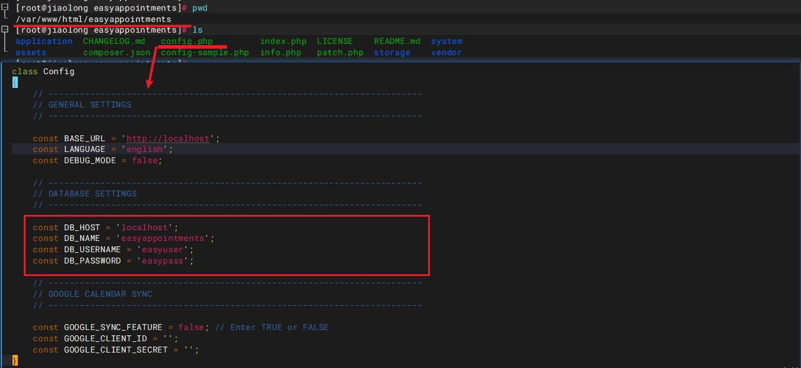

# 关闭防火墙

```bash
# 查看防火墙的状态
systemctl status firewalld

# 禁止开机启动（谨慎）
sudo systemctl disable firewalld
```

# 版本信息

- php		PHP 8.1.29 
- mysql    mysql  Ver 14.14 Distrib 5.7.44
- httpd    Apache/2.4.6 (CentOS)
- EasyAppointments 1.5.0


# 安装 PHP 和 PHP-FPM

```bash
# 安装 Remi 仓库
sudo yum install -y https://rpms.remirepo.net/enterprise/remi-release-7.rpm

# 启用 PHP 7.4 仓库
sudo yum-config-manager --enable remi-php74
sudo yum-config-manager --enable remi-php81

# 安装 PHP 及相关扩展
sudo yum install -y php php-fpm php-common php-cli php-json php-pdo php-mysqlnd \
php-zip php-gd php-mbstring php-curl php-xml php-bcmath php-json php-intl

# 启动 PHP-FPM 并设置开机自启
sudo systemctl start php-fpm
sudo systemctl enable php-fpm
```


# 安装 Nginx

```bash
sudo yum install -y nginx

# 启动并设置开机自启
sudo systemctl start nginx
sudo systemctl enable nginx

# 配置防火墙
sudo firewall-cmd --permanent --add-service=http
sudo firewall-cmd --permanent --add-service=https
sudo firewall-cmd --reload
```


# 安装 MySQL

```bash
# 安装 MySQL 官方仓库
sudo yum localinstall -y https://dev.mysql.com/get/mysql80-community-release-el7-3.noarch.rpm

# 禁用 MySQL 8.0 仓库并启用 5.7 仓库
sudo yum-config-manager --disable mysql80-community
sudo yum-config-manager --enable mysql57-community

# 安装 MySQL 5.7
sudo yum install -y --nogpgcheck mysql-community-server

# 启动并设置开机自启
sudo systemctl start mysqld
sudo systemctl enable mysqld

# 获取临时密码
grep 'temporary password' /var/log/mysqld.log

# 查看版本
mysqld --version
```

## 修改密码

```bash
# 1.编辑 MySQL 的配置文件（通常为 /etc/my.cnf 或 /etc/mysql/my.cnf），在 [mysqld] 段中添加以下内容：
# 不验证密码复杂度，及安全性
validate_password=OFF

# 2. 登录
mysql -u root -p

# 3. 修改密码
ALTER USER 'root'@'localhost' IDENTIFIED BY '1qaz2wsx';
FLUSH PRIVILEGES;

# 全局使用
use mysql;
update user set host = '%' where user = 'root';
FLUSH PRIVILEGES;

# 4. 然后重启 MySQL 服务：
sudo systemctl restart mysqld
```

## 卸载mysql

```

# 查看已安装的 MySQL 相关包
sudo yum list installed | grep mysql

# 卸载 MySQL 主包及其依赖
sudo yum remove -y mysql-community-server mysql-community-client mysql-community-libs mysql-community-common mysql-community-release
```


# httpd安装

```bash
sudo yum install httpd -y
sudo systemctl start httpd
sudo systemctl enable httpd
sudo systemctl status httpd

#端口修改为8080
sudo sed -i 's/Listen 80/Listen 8080/' /etc/httpd/conf/httpd.conf
vim /etc/httpd/conf/httpd.conf
```

## 配置虚拟主机

```bash
# 创建配置文件
vim /etc/httpd/conf.d/easyappointments.conf

<VirtualHost *:8080>
    DocumentRoot "/var/www/html/easyappointments"
    ServerName localhost
    
    <Directory "/var/www/html/easyappointments">
        Options Indexes FollowSymLinks
        AllowOverride All
        Require all granted
    </Directory>
</VirtualHost>
```

## 验证

```bash
chown -R apache:apache /var/www/html/easyappointments
chmod -R 755 /var/www/html/easyappointments
chmod -R 755 /var/www/html/easyappointments/storage

# 验证 PHP 是否与 Apache 集成
创建一个简单的 PHP 文件（例如 /var/www/html/info.php）：
<?php
phpinfo();
?>
```


# EasyAppointments安装

- ea的zip文件放在 **/var/www/html/easyappointments** 目录下

```bash
# 登录mysql 创建专用mysql账户
mysql -uroot -p
#mysql 账户创建信息
CREATE DATABASE easyappointments CHARACTER SET utf8mb4 COLLATE utf8mb4_unicode_ci;
CREATE USER 'easyuser'@'localhost' IDENTIFIED BY 'easypass';
GRANT ALL PRIVILEGES ON easyappointments.* TO 'easyuser'@'localhost';
FLUSH PRIVILEGES;
EXIT;

#复制
cp config-sample.php config.php
```

- 配置数据库信息




# session配置

- 如果不配置，那么在登录ea时，用户名密码输入正确，登录页面无反应。

## php session 是否配置

```bash
#查看php的session配置
php -i | grep "session.save_path"

#没有php的session值，执行
vim /etc/php.ini
session.save_path="/var/lib/php/session"

#如果/etc/php.ini 不存在执行如下命令：
php --ini
```


## php session是否可以写入

```bash
#验证session是否可写
cd /var/www/html/easyappointments
vim sessiontest.php,内容为：

<?php
session_start();
$_SESSION['test'] = 'ok';
echo session_id() . "\n";
echo "Session written!";
?>

ls /var/lib/php/session
查看是否存在 sess_xxx的文件

```

## 配置EA内部session配置
- 编辑配置文件

  ```bash
  vim /var/www/html/easyappointments/application/config/config.php
  # 增加内容
  $config['sess_save_path'] = '/var/lib/php/session';
  ```

  

