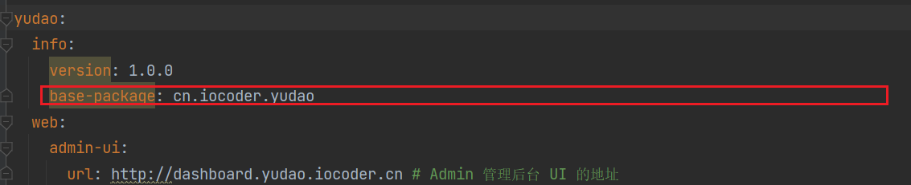
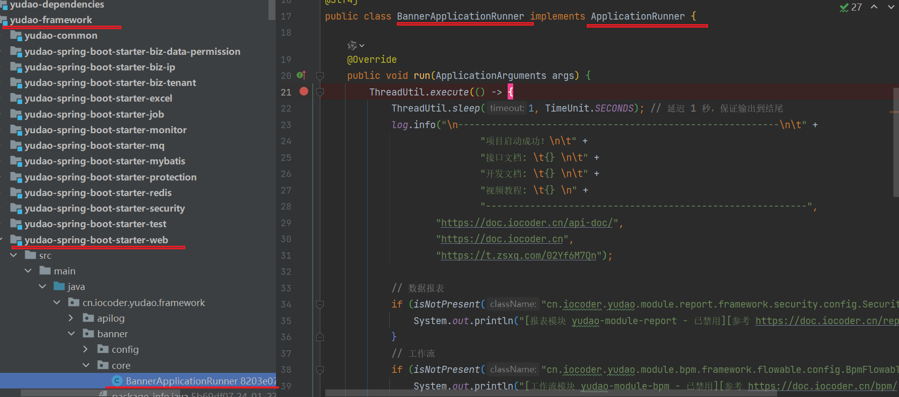
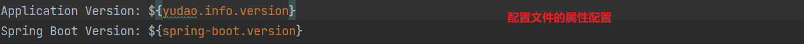
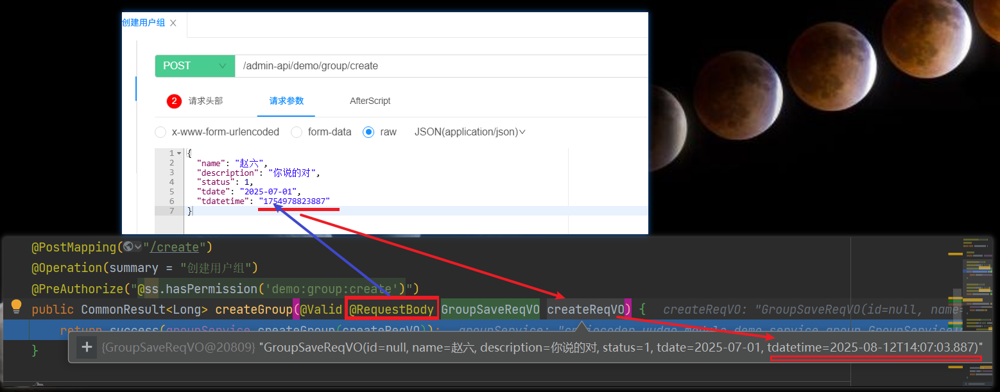
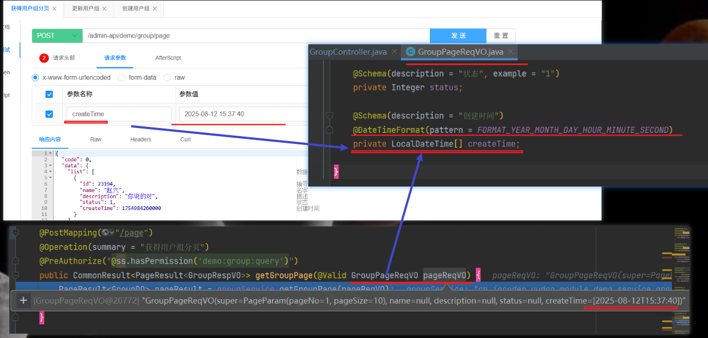
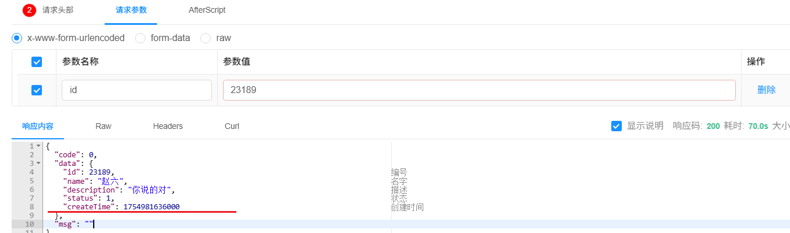

# SpringBoot

## 启动扫描

```java
@SpringBootApplication(scanBasePackages = {"${yudao.info.base-package}.server",  
                                           "${yudao.info.base-package}.module"} )
```

- ${yudao.info.base-package} 是占位符，具体信息在 `application.yaml`中配置
> 


## ApplicationRunner

- 在 Spring Boot 中，`ApplicationRunner` 接口是一个用于在应用启动后执行特定逻辑的接口。它属于 Spring Framework 的一部分，主要用于在应用上下文加载完成后、应用启动过程中执行一些初始化操作或业务逻辑。




## banner.txt

- 在 Spring Boot 应用中，banner.txt 是一个用于`自定义`**应用启动时显示的欢迎信息（即 Banner）的文件**。Spring Boot 启动时**会自动加载并显示这个文件的内容**，通常用于展示项目名称、版本号、版权信息等。

- 位置 

  > src/main/resources/banner.txt



## springBootTest

- @RunWith(SpringRunner.class)	 // <1.1>

  > @RunWith 注解，是 JUnit 所提供。
  >
  > 通过添加 @RunWith(SpringRunner.class)，告诉 JUnit 使用 SpringRunner 作为 Junit Runner，从而在测试的时候，可以创建 Spring 容器。

- @SpringBootTest(**classes = Application.class**)               

  > - `@SpringBootTest` 是 **Spring Boot Test** 模块提供的一个注解，用于启动完整的 Spring 应用上下文（ApplicationContext），以便进行集成测试。
  >
  > - classes = Application.class
  >   - **作用：指定测试时只加载 Application.class 所定义的配置，而不是自动扫描整个项目。**
  >   - 优点：
  >     1. 提高测试速度（减少不必要的 Bean 加载）。
  >     2. 避免因其他配置导致的冲突或错误。

```java
@RunWith(SpringRunner.class)
@SpringBootTest(classes = Application.class)
public class UserMapperTest {

    @Autowired
    private UserMapper userMapper;

    @Test
    public void testInsert() {
        UserDO user = new UserDO().setUsername(UUID.randomUUID().toString())
                .setPassword("nicai").setCreateTime(new Date())
                .setDeleted(0); 
        userMapper.insert(user);
    }
}

```

## 使用外部配置文件启动

```bash
java -jar  yudao-server.jar -Xms512m -Xmx512m --spring.config.location=/root/yudao-server/config/ --spring.profiles.active=dev
```


# Mybatis

## @Param

- 主要用于 **在 Mapper 接口中传递多个参数** 时，为每个参数指定一个名称，以便在 XML 映射文件中通过 `#{}` 表达式引用这些参数。

  因为MyBatis 默认会将这些参数封装成一个 Map，但如果你希望显式地为每个参数命名，就可以使用 `@Param` 注解。

```java
public interface UserMapper {
    List<User> selectUsers(@Param("username") String username, @Param("age") int age);
}

<select id="selectUsers" resultType="User">
    SELECT * FROM user
    WHERE username LIKE CONCAT('%', #{username}, '%')
      AND age = #{age}
</select>
```


# LocalDateTime问题

## 有@RequestBody注解

- **有@RequestBody 注解**指定的**参数类**中有LocalDateTime定义的属性，

  >  - 前端请求时需要将**时间**转换为**Long 格式**。
  >
  >  - `参数类型`：**@RequestBody GroupSaveReqVO createReqVO**
  
  ```java
  // 当用@RequestBody注解【限定】请求参数时  前端【请求的时间格式】必须为long类型。
  // GroupSaveReqVO类定义 LocalDateTime tdatetime;
  public CommonResult<Long> createGroup(@Valid @RequestBody GroupSaveReqVO createReqVO) {
  }
  
  public class GroupSaveReqVO {
       private LocalDateTime tdatetime;
  }
  ```
  
  
  
  
## 无@RequestBody 注解

- `没有`**@RequestBody 注解**指定的**参数类**中有LocalDateTime定义的属性，前端请求时需要将**时间**转换为**yyyy-MM-dd HH:mm:ss**。

  > - `参数类型`： **GroupSaveReqVO createReqVO**, **没有**@RequestBody 注解。
  > - 前端请求时需要将**时间**转换为**yyyy-MM-dd HH:mm:ss**。
  > - LocalDateTime 类型字段需要添加**格式化注解**： @DateTimeFormat(pattern = FORMAT_YEAR_MONTH_DAY_HOUR_MINUTE_SECOND)

  ```java
  //前端请求时需要将[时间转换为]yyyy-MM-dd HH:mm:ss格式。
  //LocalDateTime 类型字段添加格式化注解:@DateTimeFormat(pattern = FORMAT_YEAR_MONTH_DAY_HOUR_MINUTE_SECOND)
  public CommonResult<PageResult<GroupRespVO>> getGroupPage(@Valid GroupPageReqVO pageReqVO) {
  }
  
  //增加格式化注解@DateTimeFormat
  GroupPageReqVO{
      @DateTimeFormat(pattern = FORMAT_YEAR_MONTH_DAY_HOUR_MINUTE_SECOND)
      private LocalDateTime createTime;
  }
  ```

  


## LocalDateTime返回

- Response Body 的LocalDateTime定义属性，返回时会**被序列化为 Long 时间戳进行相应**。




# 全局拦截/异常/统一前缀

- [参考文章](https://www.iocoder.cn/Spring-Boot/SpringMVC/)

```java
// 统一前缀
cn.iocoder.yudao.framework.web.config.YudaoWebAutoConfiguration
// 统一返回结果
cn.iocoder.yudao.framework.web.core.handler.GlobalResponseBodyHandler
//统一异常    
cn.iocoder.yudao.framework.web.core.handler.GlobalExceptionHandler
```

