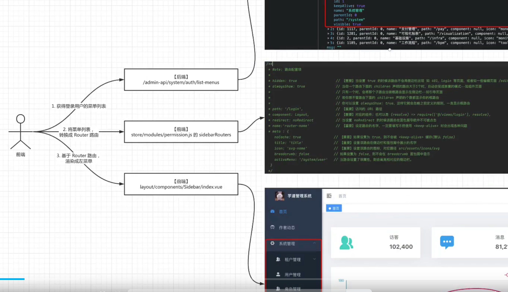

问题

问题1.登录页面没有 验证码

问题2. 后台框架 是2.5 不是3.7

问题3. app用户需要登录

下载jdk17版本的代码

- git clone  -b master-jdk17 https://gitee.com/yudaocode/yudao-boot-mini.git


## Mapper 如使用

- [MyBatis 数据库 ](https://doc.iocoder.cn/mybatis/#_3-2-selectcount)

- 案例：OAuth2AccessTokenDO 类设置了表的名称，有那些字段。

  ```
  public interface OAuth2AccessTokenMapper extends BaseMapperX<OAuth2AccessTokenDO> {
  
      default OAuth2AccessTokenDO selectByAccessToken(String accessToken) {
          return selectOne(OAuth2AccessTokenDO::getAccessToken, accessToken);
      }    
  }
  
  
  @TableName(value = "system_oauth2_access_token", autoResultMap = true)
  @Data
  @EqualsAndHashCode(callSuper = true)
  public class OAuth2AccessTokenDO extends BaseDO {
  
      /**
       * 编号，数据库递增
       */
      @TableId
      private Long id;
      /**
       * 访问令牌
       */
      private String accessToken;
  }    
  ```

  


## 后台代码的主要功能

#### 1.创建用户

> com.jinlong.backend.module.system.controller.admin.user.UserController

#### 2.后台登录验证码

> com.jinlong.backend.module.system.controller.admin.captcha.CaptchaController

#### 后台登录

> com.jinlong.backend.module.system.controller.admin.auth.AuthController

#### 令牌刷新-controller与dao

> com.jinlong.backend.module.system.controller.admin.oauth2;
> com.jinlong.backend.module.system.dal.dataobject.oauth2;

#### 令牌的操作

```java
com.jinlong.backend.module.system.service.oauth2OAuth2TokenServiceImpl
```

#### 全局异常

```java
//全局异常处理器，将 Exception 翻译成 CommonResult + 对应的异常编号
com.jinlong.backend.framework.web.core.handler.GlobalExceptionHandler
//全局响应结果（ResponseBody）处理器
com.jinlong.backend.framework.web.core.handler.GlobalResponseBodyHandler

//全局错误码枚举
com.jinlong.backend.framework.common.exception.enums.GlobalErrorCodeConstants
//错误码范围
com.jinlong.backend.framework.common.exception.enums.ServiceErrorCodeRange

//业务逻辑异常 Exception
//大多数业务场景下，我们无需处理 ServiceException 业务异常，而是通过 GlobalExceptionHandler 统一处理，转换成对应的 //CommonResult 对象，进而提示给前端即可。
//如果真的需要处理 ServiceException 时，通过 try catch 的方式进行主动捕获。
com.jinlong.backend.framework.common.exception.ServiceException

//在 Service 需抛出业务异常时，通过调用 ServiceExceptionUtil的 #exception() 方法来构建 ServiceException 异常，然后使用 throw 进行抛出。
com.jinlong.backend.framework.common.exception.util.ServiceExceptionUtil
```

## web安全过滤器

  ```
com.jinlong.backend.framework.security.config.BackendWebSecurityConfigurerAdapter.filterChain()
// 添加 Token Filter
httpSecurity.addFilterBefore(authenticationTokenFilter,UsernamePasswordAuthenticationFilter.class);


com.jinlong.backend.framework.security.core.filter.TokenAuthenticationFilter.doFilterInternal()

  ```

- **com.jinlong.backend.framework.security.core.filter.TokenAuthenticationFilter.doFilterInternal(**

| 请求情况 | token 值   | SecurityContext | 接口注解                  | 返回结果                            |
| -------- | ---------- | --------------- | ------------------------- | ----------------------------------- |
| 场景 A   | null       | 空              | `@PermitAll`              | ✅ 正常访问                          |
| 场景 B   | null       | 空              | **无注解（需登录）**      | ❌ 401 未登录                        |
| 场景 C   | 合法 token | 填充登录用户    | 无注解                    | ✅ 正常访问                          |
| 场景 D   | 合法 token | 填充登录用户    | `@PreAuthorize(权限标识)` | 再判断角色权限，成功 200 / 失败 403 |


## 功能权限06

  ```java
  com.jinlong.backend.module.system.controller.admin.permission.MenuController
  com.jinlong.backend.module.system.controller.admin.permission.RoleController
  com.jinlong.backend.module.system.controller.admin.permission.PermissionController
  
  
  //权限校验原理-功能权限06视频讲
  @PreAuthorize("@ss.hasPermission('system:menu:create')") 
      
  //@ss 定义    
  com.jinlong.backend.framework.security.config.BackendSecurityAutoConfiguration{
      @Bean("ss") // 使用 Spring Security 的缩写，方便使用
      public SecurityFrameworkService securityFrameworkService(PermissionCommonApi permissionApi) {
          return new SecurityFrameworkServiceImpl(permissionApi);
      }
  }    
  //权限校验逻辑   
  com.jinlong.backend.framework.security.core.service.SecurityFrameworkServiceImpl
   
  ```

  

## Web

```java
//统一api 前缀设置
com.jinlong.backend.framework.web.config.BackendWebAutoConfiguration.webMvcRegistrations.buildPathPrefixes()
//用户类型配置    
com.jinlong.backend.framework.common.enums.UserTypeEnum
//admin/app api 对应的扫描包    
com.jinlong.backend.framework.web.config.WebProperties
    
    
//swagger配置类  可以删除租户信息
com.jinlong.backend.framework.swagger.config.BackendSwaggerAutoConfiguration.buildGroupedOpenApi()   
    
    
//日志记录 过滤器进行日志记录
com.jinlong.backend.framework.apilog.config.BackendApiLogAutoConfiguration.apiAccessLogFilter()
//该注解 表示yaml文件的backend.access-log.enable=true时，才注册此bean
@ConditionalOnProperty(prefix = "backend.access-log", value = "enable", matchIfMissing = true)
    
//日志的filter类，有自定义@ApiAccessLog注解的处理
com.jinlong.backend.framework.apilog.core.filter.ApiAccessLogFilter.buildApiAccessLog() 
    
//自定义日志注解
com.jinlong.backend.framework.apilog.core.annotation.ApiAccessLog
```


## swagger

```
// 将该文件复制到自己的模块，设置自己模块的名字。swagger文档会进行分类
package com.jinlong.backend.module.infra.framework.web.config;
```


## 文件上传

- 根据连接获取图片

```java
//根据连接获取图片
http://127.0.0.1:48080/admin-api/infra/file/29/get/20260903/8ea70e77f8a4c175f6bcf5df91e86451cc17f14b512752c4a840d552ee8fe334.png

com.jinlong.backend.module.infra.controller.admin.file.FileController.getFileContent()
    
```


## 自定义注解案例

- [ruoyi-vue-pro自定义注解文档](https://doc.iocoder.cn/validator/#_3-自定义注解)

```java
//案例位置
com.jinlong.backend.framework.common.validation;
```


## api 访问日志


## 前端菜单动态加载



  