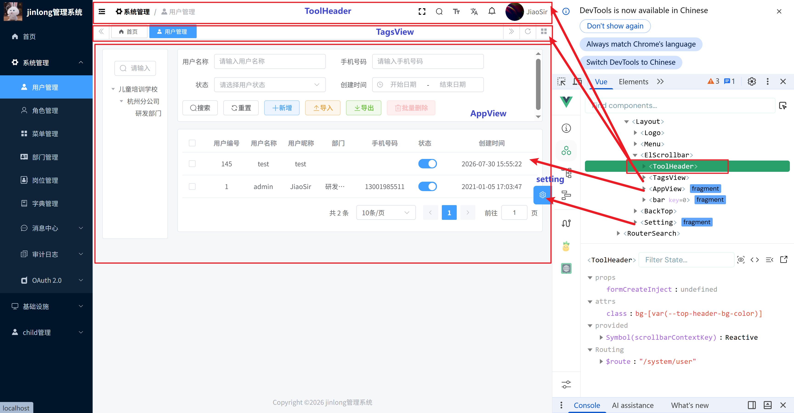
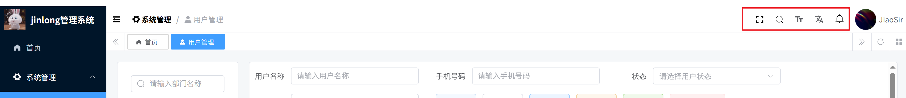
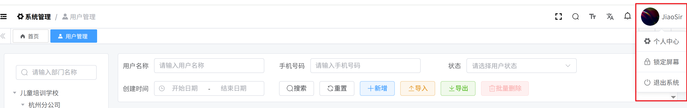

# 登录流程

## 一、总体流程图

```
浏览器输入 http://localhost/
        │
        ▼
【阶段0】Vite 开发服务器返回 index.html → 加载 main.ts（应用入口）
        │
        ▼
【阶段1】main.ts 初始化应用（setupAll）
        ├─ setupI18n()           多语言
        ├─ setupStore()          Pinia 状态管理
        ├─ setupGlobCom()        全局组件注册
        ├─ setupElementPlus()    UI 库
        ├─ setupFormCreate()     表单设计器
        ├─ setupRouter()         vue-router 挂载
        ├─ import './permission' ⭐ 注册路由守卫（副作用导入）
        └─ await router.isReady() ⭐ 等待首次路由导航完成
                  │
                  ▼
【阶段2】首次导航到 / → 触发 beforeEach 路由守卫（permission.ts）
                  │
       ┌──────────┴──────────┐
       ▼                     ▼
 判断本地有没有 token？
 (localStorage)          （首次访问：没有）
       │                     │
   有 token                没 token
       │                     │
       │            to.path=/ 不在白名单
       │                     ▼
       │          next('/login?redirect=/')  → 跳到登录页
       │                     │
       │          【阶段4】Login.vue → LoginForm.vue
       │             │
       ▼             用户输入账号密码 → handleLogin
  加载用户信息、动态路由               │
       │                    POST /system/auth/login → 返回 token
       ▼                    │
 setUserInfoAction()        authUtil.setToken() 存入 localStorage
   └─ GET /system/auth/get-permission-info   │
       （拿 permissions/roles/menus）        push(redirect || addRouters[0].path)
       │                    ▼
       ▼             再次触发 beforeEach（此时已有 token）
 generateRoutes() 按菜单生成动态路由  → 走左边分支
       │                    │
       ▼                    ▼
 router.addRoute() 动态注入路由 ──────► 最终都进入阶段3
       │
       ▼
【阶段3】真正渲染 '/' 对应页面
    '/' 路由 → Layout 组件（整体框架）
        │
        ▼
    redirect: '/index' 自动跳转
        │
        ▼
    Home/Index.vue（首页）★最终落地
```

------

## 二、按阶段详解（对应文件）

### 阶段 0-1：应用启动 — [src/main.ts](vscode-webview://01akugvesuo9s65ufgflat34ffijarvh81gu0d4on38ta4fsigls/src/main.ts)

浏览器拿到 `index.html` 后，Vite 把入口模块 `main.ts` 加载进来。关键点：

```js
import './permission'   // 注意！没有具名导出，只是"导入即执行"
```

这一行是**注册路由守卫**的核心技巧：`permission.ts` 顶层调用 `router.beforeEach(...)`，只要模块被 import 执行一次，全局守卫就挂上了。

最后 `await router.isReady()` 非常关键 —— **Vue Router 首次导航是异步的**（要经过守卫判断），`isReady()` 会等它完成才 `mount('#app')`，避免首屏闪一下空白/报错。

| 对应文件                                                     | 作用                       |
| ------------------------------------------------------------ | -------------------------- |
| [src/main.ts](vscode-webview://01akugvesuo9s65ufgflat34ffijarvh81gu0d4on38ta4fsigls/src/main.ts) | 应用装配，创建 Vue 实例    |
| [src/router/index.ts](vscode-webview://01akugvesuo9s65ufgflat34ffijarvh81gu0d4on38ta4fsigls/src/router/index.ts) | 创建路由实例（静态路由表） |
| [src/store/index.ts](vscode-webview://01akugvesuo9s65ufgflat34ffijarvh81gu0d4on38ta4fsigls/src/store/index.ts) | Pinia 实例 + 持久化插件    |

### 阶段 2：路由守卫 — [src/permission.ts](vscode-webview://01akugvesuo9s65ufgflat34ffijarvh81gu0d4on38ta4fsigls/src/permission.ts)

这是整个系统的"**权限中枢**"，也是理解本项目的核心。核心逻辑：

```js
router.beforeEach(async (to, from, next) => {
  if (getAccessToken()) {          // ① 有 token
    if (to.path === '/login') next({ path: '/' })
    else {                         // 加载用户信息 + 动态路由
      if (!userStore.getIsSetUser) {
        await userStore.setUserInfoAction()     // 调后端拿权限
        await permissionStore.generateRoutes()  // 菜单→路由
        permissionStore.getAddRouters.forEach((route) => {
          router.addRoute(route)                // ⭐ 动态注入路由
        })
        next({ path: redirect, ... })
      } else next()
    }
  } else {                         // ② 没 token
    if (whiteList.includes(to.path)) next()
    else next(`/login?redirect=${to.fullPath}`)  // → 登录页
  }
})
```

**核心思想**：路由表不是写死的，而是"**登录后从后端拿菜单 → 现场生成 → 动态注入**"。这样：

- 未登录访问任何业务页 → 一律弹回登录页
- 用户只能看到自己角色有权限的菜单，路由层面做了隔离

| 对应文件                                                     | 作用                                        |
| ------------------------------------------------------------ | ------------------------------------------- |
| [src/permission.ts](vscode-webview://01akugvesuo9s65ufgflat34ffijarvh81gu0d4on38ta4fsigls/src/permission.ts) | 全局路由守卫                                |
| [src/utils/auth.ts](vscode-webview://01akugvesuo9s65ufgflat34ffijarvh81gu0d4on38ta4fsigls/src/utils/auth.ts) | token 读写（封装 localStorage）             |
| [src/store/modules/user.ts](vscode-webview://01akugvesuo9s65ufgflat34ffijarvh81gu0d4on38ta4fsigls/src/store/modules/user.ts) | 用户信息 store（调 get-permission-info）    |
| [src/store/modules/permission.ts](vscode-webview://01akugvesuo9s65ufgflat34ffijarvh81gu0d4on38ta4fsigls/src/store/modules/permission.ts) | 路由表 store（generateRoutes / addRouters） |
| [src/hooks/web/useCache.ts](vscode-webview://01akugvesuo9s65ufgflat34ffijarvh81gu0d4on38ta4fsigls/src/hooks/web/useCache.ts) | localStorage 封装（web-storage-cache）      |
| [src/api/login/index.ts](vscode-webview://01akugvesuo9s65ufgflat34ffijarvh81gu0d4on38ta4fsigls/src/api/login/index.ts) | 登录/用户信息 API                           |

### 阶段 3：渲染首页 — [src/router/modules/remaining.ts](vscode-webview://01akugvesuo9s65ufgflat34ffijarvh81gu0d4on38ta4fsigls/src/router/modules/remaining.ts)

```js
{
  path: '/',
  component: Layout,        // 整个后台框架（侧边栏+顶栏+内容区）
  redirect: '/index',       // 访问 / 自动跳首页
  children: [{ path: 'index', component: Home/Index.vue }]
}
```

注意：`remainingRouter` 是**启动时就注册的静态路由**，只包含框架、登录页、404 等；业务菜单路由是阶段 2 动态加进去的，所以 `addRouters` 会拼在 Layout 的 children 里（见 [permission.ts 的 generateRoute](vscode-webview://01akugvesuo9s65ufgflat34ffijarvh81gu0d4on38ta4fsigls/src/store/modules/permission.ts#L42)）。

### 阶段 4：登录 — [src/views/Login/](vscode-webview://01akugvesuo9s65ufgflat34ffijarvh81gu0d4on38ta4fsigls/src/views/Login/)

首次访问走的是这条线：**Login.vue → LoginForm.vue → handleLogin → 调登录 API → 存 token → 跳转**。跳转后再次触发守卫，此时有 token 了，进入阶段 2 的左分支，最终落回阶段 3。

# Layout


## 一、登录成功后主页是如何展示的

### 1. 登录动作发起 → 跳转 `/`

登录在 [LoginForm.vue](vscode-webview://01akugvesuo9s65ufgflat34ffijarvh81gu0d4on38ta4fsigls/src/views/Login/components/LoginForm.vue#L157-L196) 的 `handleLogin` 中完成：

1. 校验表单 → 调用 `LoginApi.login()` 拿 token；
2. `authUtil.setToken(res)` 写入 token；
3. 若 URL 上没有 `?redirect=xxx`，则 `redirect.value = '/'`；
4. `push(redirect)` 跳转（代码里还打印了 `permissionStore.addRouters[0].path` 便于调试）。

### 2. 路由守卫：拉取用户信息 + 注册动态路由

[permission.ts](vscode-webview://01akugvesuo9s65ufgflat34ffijarvh81gu0d4on38ta4fsigls/src/permission.ts#L60-L101) 的 `beforeEach` 在跳转前拦截：

- 已有 token 且首次进入（!userStore.getIsSetUser）时：

  - `setUserInfoAction()` 请求用户信息与菜单（后端过滤菜单）；
  - `permissionStore.generateRoutes()` 把后端菜单通过 [routerHelper.ts](vscode-webview://01akugvesuo9s65ufgflat34ffijarvh81gu0d4on38ta4fsigls/src/utils/routerHelper.ts#L67-L174) 的 `generateRoute` 转换成 vue-router 路由表；
  - `router.addRoute()` 逐个动态注册；404 兜底路由最后追加；
- 再 `next()` 到 `/`。

### 3. 静态路由 `/` → 挂载 Layout

[remaining.ts](vscode-webview://01akugvesuo9s65ufgflat34ffijarvh81gu0d4on38ta4fsigls/src/router/modules/remaining.ts#L52-L71) 中定义了静态首页路由：

```
/ → Layout（redirect 到 /index）
    /index → views/Home/Index.vue（仪表盘）
```

所以跳转到 `/` 后，先渲染 [Layout.vue](vscode-webview://01akugvesuo9s65ufgflat34ffijarvh81gu0d4on38ta4fsigls/src/layout/Layout.vue)，再经 `redirect` 落到 `/index`，即 [Home/Index.vue](vscode-webview://01akugvesuo9s65ufgflat34ffijarvh81gu0d4on38ta4fsigls/src/views/Home/Index.vue)（统计卡片 + ECharts 饼图/柱图/折线图）。

### 4. Layout.vue 选择布局并渲染



[Layout.vue](vscode-webview://01akugvesuo9s65ufgflat34ffijarvh81gu0d4on38ta4fsigls/src/layout/Layout.vue#L27-L44) 根据 `appStore.getLayout`（默认 `classic`）调用 `useRenderLayout` 中对应渲染函数，外围包一层：移动端遮罩、`<Backtop>` 回到顶部、`<Setting>` 右侧设置按钮。

以 **classic 布局**（[useRenderLayout.tsx](vscode-webview://01akugvesuo9s65ufgflat34ffijarvh81gu0d4on38ta4fsigls/src/layout/components/useRenderLayout.tsx#L39-L119)）为例，主页从上到下、从左到右：

```
┌─────────┬──────────────────────────────┐
│  Logo   │  ToolHeader（顶栏）           │  src/layout/components/ToolHeader.vue
│  侧边栏  ├──────────────────────────────┤
│  Menu   │  TagsView（标签页）           │
│         │  AppView（router-view 内容区）│
└─────────┴──────────────────────────────┘
```

- 左侧：`Logo`（系统名）+ `Menu`（根据权限路由生成菜单）；

- 右侧内容区被 **ElScrollbar**包裹：

  - `ToolHeader` 顶栏（面包屑、折叠按钮、全屏、语言、消息、用户信息等）；
  - `TagsView` 多页签；
  - `AppView` 渲染 `<router-view>` 并带 `<keep-alive>` 缓存，最终显示首页仪表盘。

  

### 5. 无感刷新

[AppView.vue](vscode-webview://01akugvesuo9s65ufgflat34ffijarvh81gu0d4on38ta4fsigls/src/layout/components/AppView.vue#L25-L33) 用 `provide('reload')` 提供刷新方法（`routerAlive` 置 false 再 nextTick 置 true），配合标签页的"刷新当前页"实现页面无白屏重载。


# 一张图总结 classic 布局的 DOM 结构

```
section.v-layout__classic (100% × 100%)
├── div.absolute.left (200px，或折叠 64px)
│   ├── Logo  (50px)
│   └── Menu  (ElMenu，剩全高)
└── div.v-layout-content (left:200px, width:100%-200px)
    └── ElScrollbar (页面滚动，顶部让出 85px)
        ├── div.fixed (fixedHeader 时固定)
        │   ├── ToolHeader (50px) ← 头部
        │   └── TagsView   (35px) ← 标签页
        ├── AppView
        │   ├── section.p-20px → <router-view> → 当前页面 ← 右中部
        │   └── Footer (50px)                            ← 底部
        └── (空余滚动空间)
```

> 另外两种布局只是改变了这些块的摆放方式：`top` 把菜单横放到顶部，`topLeft` 菜单在左侧但头在顶部，`cutMenu` 左侧换成 icon 式 TabMenu。渲染逻辑都在同一个 `useRenderLayout.tsx`，切换由 `appStore.getLayout` 控制（[Layout.vue:27-44](vscode-webview://01akugvesuo9s65ufgflat34ffijarvh81gu0d4on38ta4fsigls/src/layout/Layout.vue#L27-L44)）。


## 布局重要文件

### Layout.vue

- src/layout/Layout.vue

```ts
const renderLayout = () => {
  switch (unref(layout)) {
    case 'classic':
      const { renderClassic } = useRenderLayout()
      return renderClassic()
    case 'topLeft':
      const { renderTopLeft } = useRenderLayout()
      return renderTopLeft()
    case 'top':
      const { renderTop } = useRenderLayout()
      return renderTop()
    case 'cutMenu':
      const { renderCutMenu } = useRenderLayout()
      return renderCutMenu()
    default:
      break
  }
}
```

### useRenderLayout

- src/layout/components/useRenderLayout.tsx#L39-L119)

```ts
<div
  class={[
    {
      'fixed top-0 left-0 z-10': fixedHeader.value,
      'w-[calc(100%-var(--left-menu-min-width))] !left-[var(--left-menu-min-width)]':
        collapse.value && fixedHeader.value && !mobile.value,
      'w-[calc(100%-var(--left-menu-max-width))] !left-[var(--left-menu-max-width)]':
        !collapse.value && fixedHeader.value && !mobile.value,
      '!w-full !left-0': mobile.value
    }
  ]}
  style="transition: all var(--transition-time-02);"
>
      
  //（顶栏）   
  <ToolHeader
    class={[
      'bg-[var(--top-header-bg-color)]',
      {
        'layout-border__bottom': !tagsView.value
      }
    ]}
  ></ToolHeader>

  {tagsView.value ? (
    <TagsView class="layout-border__top layout-border__bottom"></TagsView>
  ) : undefined}
</div>

//内容页面
<AppView></AppView>
```


### ToolHeader.vue

- src/layout/components/ToolHeader.vue

  > 

```html
export default defineComponent({
  name: 'ToolHeader',
  setup() {
    return () => (
      <div
        id={`${variables.namespace}-tool-header`}
        class={[
          prefixCls,
          'h-[var(--top-tool-height)] relative px-[var(--top-tool-p-x)] flex items-center justify-between',
          'dark:bg-[var(--el-bg-color)]'
        ]}
      >
        {layout.value !== 'top' ? (
          <div class="h-full flex items-center">
            {hamburger.value && layout.value !== 'cutMenu' ? (
              <Collapse class="custom-hover" color="var(--top-header-text-color)"></Collapse>
            ) : undefined}
            {breadcrumb.value ? <Breadcrumb class="lt-md:hidden"></Breadcrumb> : undefined}
          </div>
        ) : undefined}
        <div class="h-full flex items-center">
          {screenfull.value ? (
            <Screenfull class="custom-hover" color="var(--top-header-text-color)"></Screenfull>
          ) : undefined}
          {search.value ? <RouterSearch isModal={false} color="var(--top-header-text-color)"/> : undefined}
          {size.value ? (
            <SizeDropdown class="custom-hover" color="var(--top-header-text-color)"></SizeDropdown>
          ) : undefined}
          {locale.value ? (
            <LocaleDropdown
              class="custom-hover"
              color="var(--top-header-text-color)"
            ></LocaleDropdown>
          ) : undefined}
          {message.value ? (
            <Message class="custom-hover" color="var(--top-header-text-color)"></Message>
          ) : undefined}
            
          <UserInfo></UserInfo>
        </div>
      </div>
    )
  }
})
```

- src\layout\components\UserInfo\src\UserInfo.vue

  > 

```html
<template>
  <ElDropdown class="custom-hover" :class="prefixCls" trigger="click">
    <div class="flex items-center">
        //登录图片
      <ElAvatar :src="avatar" alt="" class="w-[calc(var(--logo-height)-25px)] rounded-[50%]" />
        
        //用户名
      <span class="pl-[5px] text-14px text-[var(--top-header-text-color)] <lg:hidden">
        {{ userName }}
      </span>
    </div>
    <template #dropdown>
      <ElDropdownMenu>
           //个人中心 锁屏 、 退出系统
        <ElDropdownItem>
          <Icon icon="ep:tools" @click="toProfile" />
          <div>{{ t('common.profile') }}</div>
        </ElDropdownItem>       
        <ElDropdownItem divided @click="lockScreen">
          <Icon icon="ep:lock" />
          <div>{{ t('lock.lockScreen') }}</div>
        </ElDropdownItem>
        <ElDropdownItem divided @click="loginOut">
          <Icon icon="ep:switch-button" />
          <div>{{ t('common.loginOut') }}</div>
        </ElDropdownItem>
          
      </ElDropdownMenu>
    </template>
  </ElDropdown>

  <LockDialog v-if="dialogVisible" v-model="dialogVisible" />

  <teleport to="body">
    <transition name="fade-bottom" mode="out-in">
      <LockPage v-if="getIsLock" />
    </transition>
  </teleport>
</template>
```

